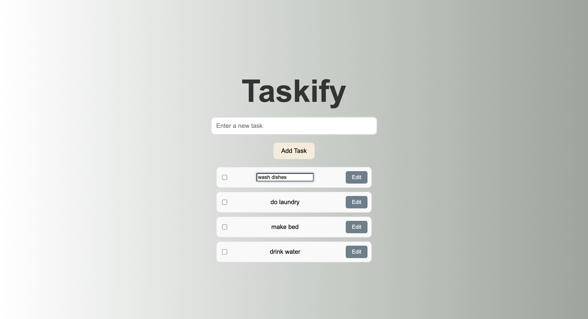

# Taskify

**Taskify** is a simple task management web app built with **TypeScript**. It lets you easily:

- Add tasks to your to-do list
- Keep track of your tasks
- Tasks pop up immediately as you add them
- Click the checkboxes to mark tasks as complete
- Once checked off, the task also gets a strikethrough
- Edit button to modify task text

---

### Seriously, is there anything more satisfying than seeing that check mark and a strikethrough on a task?

---

## Happy taskifying! 🎉
